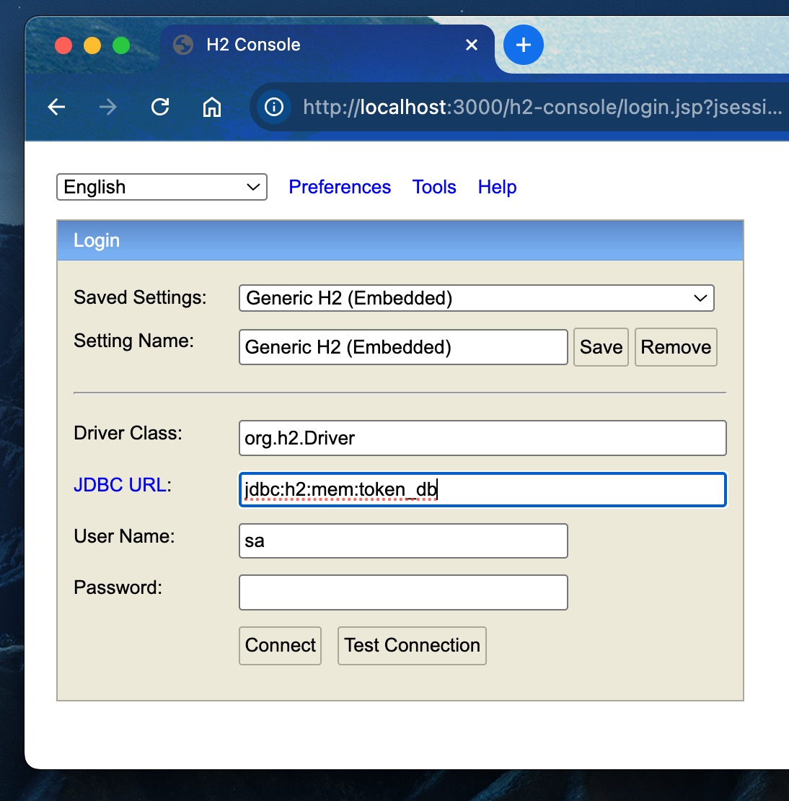
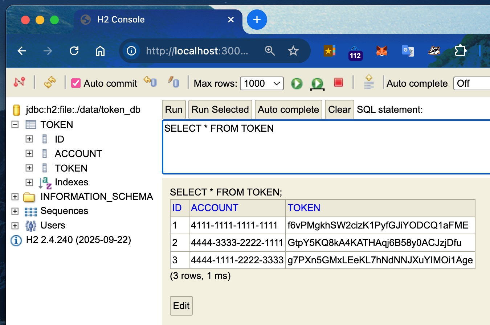
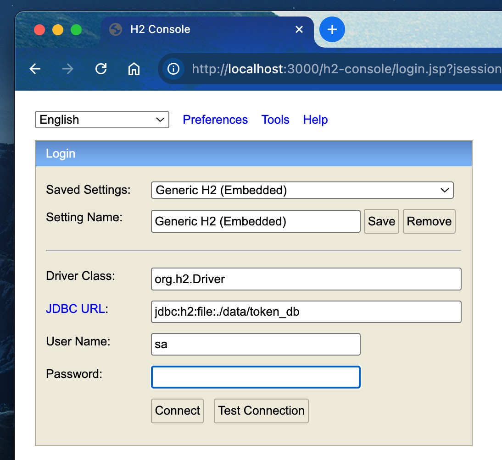

# Tokernization API(Spring Boot Prototype)

This is a lightweight Spring Boot service demonstrating a tokenization workflow using an in-memory  **H2 database** . It allows for the secure exchange of sensitive data (like credit card or account numbers) for unique, 32-character alphanumeric tokens. Two API services will be provided at port 3000.

1. A tokenization API that takes a list of account numbers (or any confidential data) as input then generates a list of tokens matching those account numbers before saving both account numbers and tokens to Tokens table. The list of tokens generated will be returned as API response.

* **URL:** `http://localhost:3000/tokens`
* **Method:** `POST`
* **Content-Type:** `application/json`
* Sample request
  ```
  [
      "4111-1111-1111-1111",
      "4444-3333-2222-1111",
      "4444-1111-2222-3333"
    ]
  ```
* Sample response body
  ```
  [
    "837NUbAQB3Kfw1dx3Z4FGXQvgHY8DrSg",
    "HFEDLmyg0JlBGVMPD4pWcFbbNo2aVlM0",
    "VsxKRSpJSamOYoMt2XndFag8VCsILhdB"
    ]
  ```

2 A detokenization API that takes a list of tokens (generated from Tokenization API) as input to retrieve the list of account numbers from backend Token table.

* **URL:** `http://localhost:3000/tokens/resolve`
* **Method:** `POST`
* **Content-Type:** `application/json`
* Sample request
  ```
  [
    "837NUbAQB3Kfw1dx3Z4FGXQvgHY8DrSg",
    "HFEDLmyg0JlBGVMPD4pWcFbbNo2aVlM0",
    "VsxKRSpJSamOYoMt2XndFag8VCsILhdB"
    ]
  ```
* Sample response body
  ```
  [
      "4111-1111-1111-1111",
      "4444-3333-2222-1111",
      "4444-1111-2222-3333"
    ]
  ```

The integration test class TokenControllerIntegrationTest showcases the use of JUnit 5 with AssertJ to verify behaviour of both API services above.

## Getting Started

### Prerequisite/Assumptions

* Gradle 8.14.1 and Java 17 used in this project.

### How to build

Check out the project first from Github. Go to the folder of the project in command line then build it by running:

* gradle clean build -DskipTests

### Run application

* gradle bootRun

### Run Integration tests

* Run all unit tests in TokenControllerIntegrationTest. Make sure to stop the running API above first else the tests will fail.
  * gradle test --tests "TokenControllerIntegrationTest"

### Comment

* Just use a good IDE like IntelliJ to save yourself the trouble of using command line above!

## H2 Database Console

After starting up the application, you can access the H2 database console at `http://localhost:3000/h2-console` in browser.

<a href="images/h2-console_1.jpg">
  
</a>

Click 'Connect' button from above screenshot to login, then one can run SQL query to see all the tokens inserted. Cool!

<a href="images/sql-query.jpg">
  
</a>

By the way, if one wants to keep the tables and its data between restarts, just change the ddl-auto from 'create-drop' to 'update' and spring.datasource.url to 'jdbc:h2:mem:token_db' in application-dev.yml then restarts the application. From now on, the tables generated by JPA and data inserted will persist across restarts but there are some important limitations to be aware of:

* It will add new tables and columns ✅
* It will NOT drop removed columns or tables ❌ — if you delete a field from your entity, the column stays in the DB
* It will NOT rename columns — it sees a rename as "delete old + add new", so the old column stays and a new empty one is created

Also don't forget to change 'JDBC URL' field to 'jdbc:h2:file:./data/token_db' in H2 console http://localhost:3000/h2-console after changing the config spring.datasource.url to 'jdbc:h2:file:./data/token_db' in application-dev.yml in order to log into H2 console backed by file-based database. See

<a href="images/h2-console_2.jpg">
  
</a>


## Warning:

The application is using dev profile by default (specified in application.yml) so the config 'spring.datasource.jpa.hibernate.ddl-auto: create-drop' from application-dev.yml is used. This should only be used for in-memory database in your local machine. Using it against UAT or Prod database will drop existing tables having the same name as an existing JPA (e.g., Token). Do this only if you want to get fired!

This is so dangerous I feel obligated to explain it clearly.

### 1. Why dangerous?

The **create-drop** setting follows a specific, destructive lifecycle every time your Spring Boot application starts and stops:

* On Startup: Hibernate looks at your @Entity classes. It will run DROP TABLE IF EXISTS for every table defined in your code, and then run CREATE TABLE.
  * Result: If you had millions of rows of production data, they are deleted instantly the moment the app starts.
* On Shutdown: When the application stops (or crashes), Hibernate runs DROP TABLE again.
  * Result: Your database is left completely empty.

### 2. The Risks summarized

* Unwanted Tables: It will automatically create tables for any new entity you’ve started drafting, even if they aren't ready for production.
* Data Overwriting: It doesn't "update" columns; it wipes the table and starts over. You lose all existing records.
* Accidental Execution: If a developer accidentally runs the app locally but points it to the UAT/Prod database string, the database is wiped before anyone can hit "Stop."!

Also don't run any unit tests with create-drop setting when the profile is connecting to a real external database!

---

**Author** Samuel Huang
